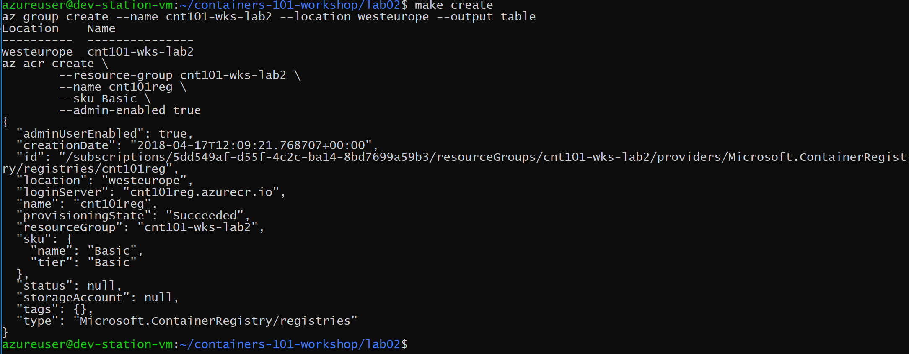
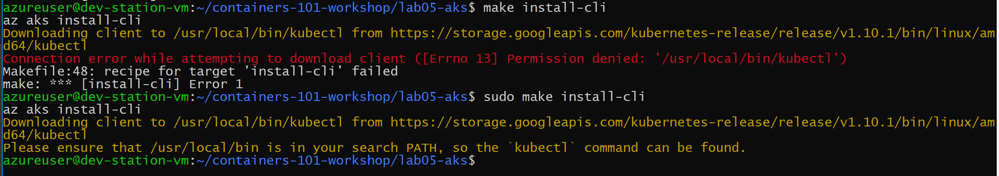
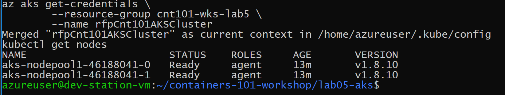
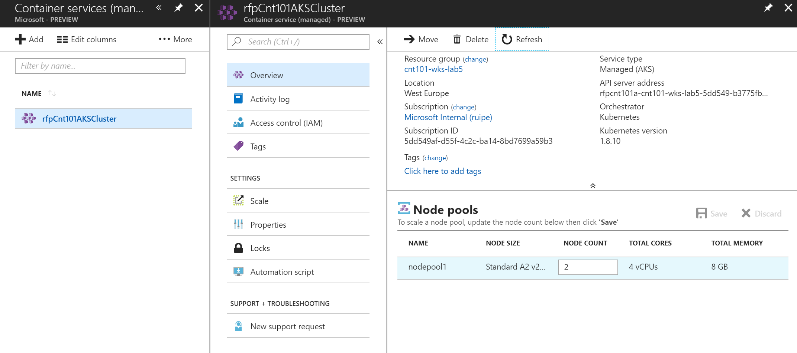

# Containers 101 Workshop Hands-on-Labs

All the materials are available [here](https://github.com/ruifelixpereira/containers-101-workshop).


## Lab 00. Environment Setup (10 min)

**Prepare VM**

Create a new Ubuntu VM  17.10 (e.g., size B2s) in Azure and install `make` on it:

```shell
sudo apt install make
```

**Clone lab materials**

Now, inside your new workstation VM just clone all the materials from github:

```shell
git clone https://github.com/ruifelixpereira/containers-101-workshop.git
```

**Install Docker**

I've prepared a `Makefile` to automate the installation for you:

```shell
cd containers-101-workshop
cd lab00-setup
make setup-docker
```

Now, just logout and login again to reflect changes in your user and test that docker is running:

```shell
make test-docker
```

Alternatively, if you prefer you can follow the instructions available:
* Install Docker CE on Ubuntu like [this](https://docs.docker.com/install/linux/docker-ce/ubuntu/#install-using-the-repository) 
* Add user to `docker` group to avoid having to do `sudo` everytime, like [this](https://docs.docker.com/install/linux/linux-postinstall/)
* Logout and login again to reflect changes in your user.

**Install Azure CLI 2.0**

You can use the same `Makefile` and run:

```shell
make setup-az
```

and in the end just test it:

```shell
make test-az
```

Alternatively, if you prefer you can follow the instructions available [here](https://docs.microsoft.com/en-us/cli/azure/install-azure-cli-apt?view=azure-cli-latest)


**Install jq**

`jq` is a tool for processing JSON inputs which is useful in some cases. To install it just use:

```shell
make setup-jq
```

and in the end just test it with:

```shell
jq
```


## Lab 01. Containers Hello World (10 min)

Here I am introducing some docker concepts like *image*, *container* and *Dockerfile*. Just examine the provided `Dockerfile` with a very simple example:

```docker
FROM node:8.9.3-alpine
RUN mkdir -p /usr/src/app
COPY ./app/* /usr/src/app/
WORKDIR /usr/src/app
RUN npm install
CMD node /usr/src/app/index.js
```

Let's explore this in more detail.

**Containers "Hello World"**

I've prepared a `Makefile` to automate the lab steps for you (just to avoid having to write too much):

```shell
cd containers-101-workshop
cd lab01-docker
make build
```

This creates a new container image `my-hello-app`. You can check in the end the images added to your local repository:

```shell
docker images
```

or running:

```shell
make show
```

which will give this output:


You can test running a new container instance from the newly created image by using either of these commands:

```shell
docker run -d -p 8080:80 my-hello-app
```

or

```shell
make run
```

and invoke with

```shell
make test
```

This is a sample output:


And you can check the docker processes running with

```shell
make ps
```


Alternatively, if you prefer you can follow the [step by step](https://docs.microsoft.com/en-us/azure/container-instances/container-instances-tutorial-prepare-app) instructions.

I am using this [application](https://github.com/Azure-Samples/aci-helloworld) for testing purposes.


## Lab 02. Private Container Registry (10 min)

Let's create a private container registry in Azure using the Azure Container Registry service.

**Prepare**

First you need to login with:

```shell
az login
```

I've prepared a `Makefile` to automate the lab steps for you (just to avoid having to write too much) that uses Azure CLI 2.0, but you need to customize it at least by putting your Azure subscription Id in `SUBSCRIPTION`:

```shell
# Set environment variables
export LOCATION?=westeurope
export NAMESPACE_PREFIX?=cnt101-wks
export RESOURCE_GROUP=$(NAMESPACE_PREFIX)-lab2
export APP_NAME?=my-hello-app
export ACR_NAME?=cnt101reg
export SUBSCRIPTION?=5dd549af-d55f-4c2c-ba14-8bd7699a59b3
```
To guarantee that you are working in the right subscription:

```shell
cd containers-101-workshop
cd lab02-acr
make
```

And check the correct subscription ID, like in my example:


**Create new registry**

To create the new registry:

```shell
cd containers-101-workshop
cd lab02-acr
make create
```

This creates a new container registry `cnt101-wks-lab2`. If you want you can change this name by updating the environment variables in your `Makefile`. The output produced should be something like:



You can check the created registry:

```shell
make show
```


And you can also login in the new container registry:

```shell
make login
```


Alternatively, if you prefer you can follow the [step by step](https://docs.microsoft.com/en-us/azure/container-instances/container-instances-tutorial-prepare-acr).


**Push image to registry**

Let's also test to push a local image into our new registry.

First, list your local images:

```shell
make list-local
```


And tag the existing image `my-hello-app` with a version and the registry prefix to `cnt101reg.azurecr.io/my-hello-app:v1`

```shell
make tag-image
```


And now you can push the tagged local image to your registry

```shell
make push-image
```


Just list the images in the registry to check the new one

```shell
make list-registry
make show-tags
```


## Lab 03: Deploy Azure Container Image (10 min)

Assuming that you have completed the previous *Lab02* with the creation of a private container registry and the upload of a sample image, let's now create an instance of such image using the simple service Azure Container Image.

You can check this by running

```shell
cd containers-101-workshop
cd lab03-aci
make
```


**Deploy App**

Deploy the app container by running

```shell
make create
```

And check in the end if it's running

```shell
make validate
```


To test it just get the URL

```shell
make get-fqdn
```


Now for testing just use wget

```shell
make test-aci
```

or invoke the url in your browser, like in my example: 
`http://rfp-aci-hello-app.westeurope.azurecontainer.io`


You can also view the log output of the container:

```shell
make get-logs
```


Alternatively, if you prefer you can follow the [step by step](https://docs.microsoft.com/en-us/azure/container-instances/container-instances-tutorial-deploy-app).


## Lab 04: Simple Web App in Containers (10 min)

Assuming that you have completed the previous *Lab02* with the creation of a private container registry and the upload of a sample image, let's now create an Azure Web App based in a container instance of such image.

You can check this by running

```shell
cd containers-101-workshop
cd lab04-webapp
make
```


**Deploy App**

Deploy the web  app container by running

```shell
make create
```

And check in the end the uRL of the new Web app

```shell
make get-webapp-url
```


You can also check the docker registry settings of the new web app:


Now for testing just use wget

```shell
make test-webapp
```


or invoke the url in your browser, like in my example: 
`http://my-hello-app.azurewebsite.net`


You can also change application settings environment variables like this example:

```shell
make config-env
```


And you can also check these changes in the Azure Portal


Alternatively, if you prefer you can follow the [step by step](https://docs.microsoft.com/en-us/azure/app-service/containers/tutorial-custom-docker-image#use-a-docker-image-from-any-private-registry-optional).


### Lab 05: Create an Azure Managed Kubernetes cluster (25 min)

Until now we've been playing with simple scenarios, almost single container applications. Let's now move on to a scenario where we need to create an application with several components and deploy it in a Kubernetes cluster. We will continue to use the container registry created in the previous *Lab02*.

Let's start by checking that our environment is ready:

```shell
cd containers-101-workshop
cd lab05-aks
make
```


**Create the Kubernetes cluster**

Create the managed Kubernetes cluster with

```shell
make create
```


In Kubernetes we need the kubectl tool to talk with the orchestrator that resides in the master node(s). To install it in our workstation just do:

```shell
make install-cli
```

If you get a *permission denied* error, just do:

```shell
sudo make install-cli
```



Now let's validate that our cluster is ready and we can administer it with kubectl.

```shell
make validate
```

We can see here that our cluster has 2 agent nodes to run our application workloads.



In the Azure Portal we can also see the created cluster:



Since we might deploy applications where the container images reside in the registry created in *Lab02*, let's ensure that the new Kubernetes cluster has the proper permissions to access it:

```shell
make allow-access-to-acr
```


And just validate this access:

```shell
make check-access-to-acr
```


**Access to the Kubernetes management console**

We have available the Kubernetes console that is only accessible locally with a tunnel. To start the tunnel you can do it in 2 ways:

If you are in your workstation:

```shell
make browse-console &
```

If you are in a remote workstation using SSH:

```shell
kubectl proxy --port 8001 &
```

and create a tunnel to the remote workstation using something like this sample:

```shell
ssh -L 9000:127.0.0.1:8001 azureuser@52.138.214.117
```

And then browse to [http://localhost:9000/ui](http://localhost:9000/ui)

In case you get an error like this one:


just replace the URL from this

http://localhost:9000/api/v1/namespaces/kube-system/services/https:kubernetes-dashboard:/proxy/

to this

http://localhost:9000/api/v1/namespaces/kube-system/services/http:kubernetes-dashboard:/proxy/


**Deploy the app**

Our sample [Azure Vote](https://docs.microsoft.com/en-us/azure/aks/tutorial-kubernetes-prepare-app) application has 2 components (2 containers) that will be deployed in 2 Kubernetes pods:
* Redis cache listening at port 6379.
* Web frontend listening at port 80 that uses data residing in the Redis cache.

This is the sample Kubernetes yaml file with the 2 components which are mapped to 2 Kubernetes Deployments and 2 Kubernetes Services:

```yaml
apiVersion: apps/v1beta1
kind: Deployment
metadata:
  name: azure-vote-back
spec:
  replicas: 1
  template:
    metadata:
      labels:
        app: azure-vote-back
    spec:
      containers:
      - name: azure-vote-back
        image: redis
        ports:
        - containerPort: 6379
          name: redis
---
apiVersion: v1
kind: Service
metadata:
  name: azure-vote-back
spec:
  ports:
  - port: 6379
  selector:
    app: azure-vote-back
---
apiVersion: apps/v1beta1
kind: Deployment
metadata:
  name: azure-vote-front
spec:
  replicas: 1
  strategy:
    rollingUpdate:
      maxSurge: 1
      maxUnavailable: 1
  minReadySeconds: 5 
  template:
    metadata:
      labels:
        app: azure-vote-front
    spec:
      containers:
      - name: azure-vote-front
        image: microsoft/azure-vote-front:v1
        ports:
        - containerPort: 80
        resources:
          requests:
            cpu: 250m
          limits:
            cpu: 500m
        env:
        - name: REDIS
          value: "azure-vote-back"
---
apiVersion: v1
kind: Service
metadata:
  name: azure-vote-front
spec:
  type: LoadBalancer
  ports:
  - port: 80
  selector:
    app: azure-vote-front
```

Let's deploy this app to our cluster:

```shell
make deploy-app
```


You can also check the docker registry settings of the new web app:


Now for testing just use wget

```shell
make test-webapp
```


or invoke the url in your browser, like in my example: 
`http://my-hello-app.azurewebsite.net`


You can also change application settings environment variables like this example:

```shell
make config-env
```


And you can also check these changes in the Azure Portal


Alternatively, if you prefer you can follow the [step by step](https://docs.microsoft.com/en-us/azure/aks/kubernetes-walkthrough).


In this lab we used the Azure Vote sample applciation. If you want mode details about it just check [here](https://docs.microsoft.com/en-us/azure/aks/tutorial-kubernetes-prepare-app).


### Lab 06: Advanced Kubernetes (40 min)

TBD
